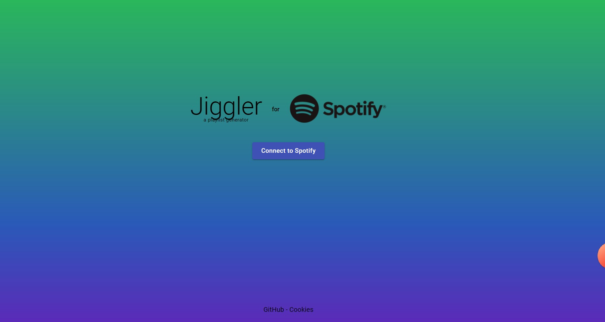
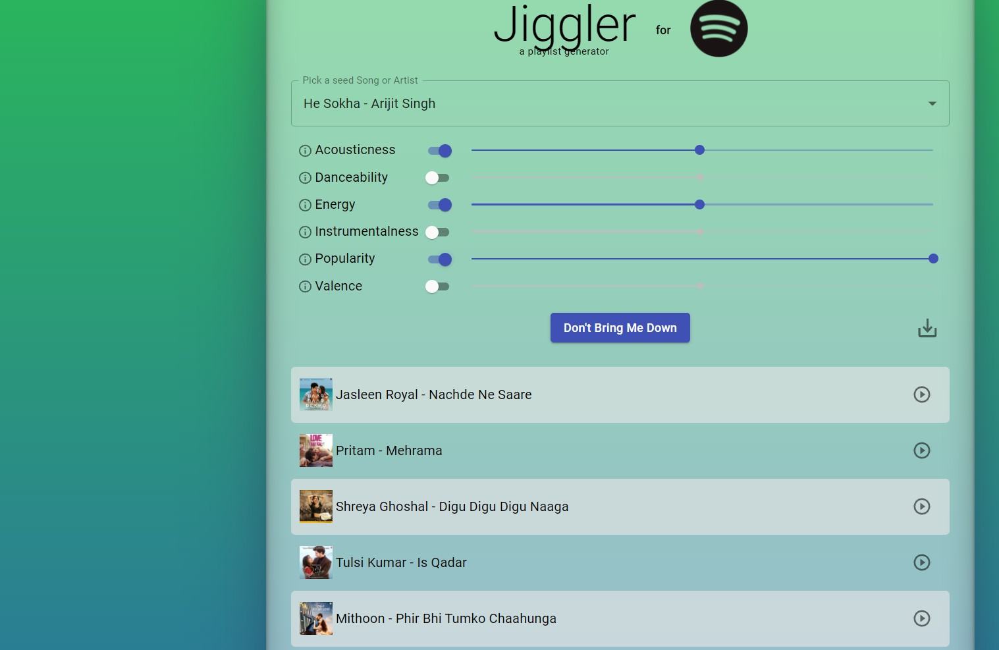

# Jiggler, a playlist generator for Spotify

A React app aimed to give users more control over the Spotify recommendation engine. 

## Features
- Built in search
- Genres could be set 🤘
- Fast in grabbing information and downloading 🚀
- Authorization and authenctication
- Responsive 😎
- Also usable on iOS & Android

## Screenshots



[![Jiggler]](12-43-38.mp4)

Install dependencies and start:
```
npm install
npm start
```

The app should be live at `http://localhost/3000`


